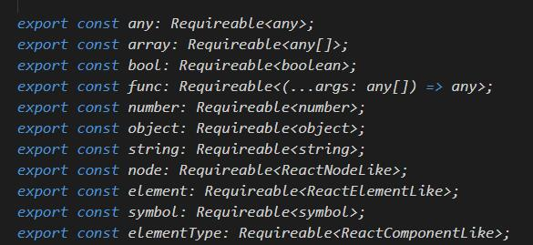

# PropTypes&DefaultProps

## 1. PropTypes

> 对于props数据进行类型校验。

### 1.1 引入包

```js
import PropTypes from "prop-types";
```

### 1.2 使用

```js
// component
import React, { Component } from "react";
class App extends Component {
  // TODO
  // content index handleItemDelete
}

// use => componentName.propTypes = { attributes }
App.propTypes = {
  content: PropTypes.string,
  handleItemDelete: PropTypes.func,
  index: PropTypes.number
}
```

### 1.3 类型分类



- any

- array

- bool

- func

- number

- object

- string

- node

- element

- symbol

- elementType

### 1.4 isRequired

```js
App.propTypes = {
  test: PropTypes.string.isRequired
}
// 如果没有加isRequired，如果父组件没有传值，不会报错，如果加上不传值就会报错。
```

## 2. DefaultProps

> 给props赋默认值。

### 2.1 使用

```js
App.defaultProps = {
  test: "hello-world"
}
```