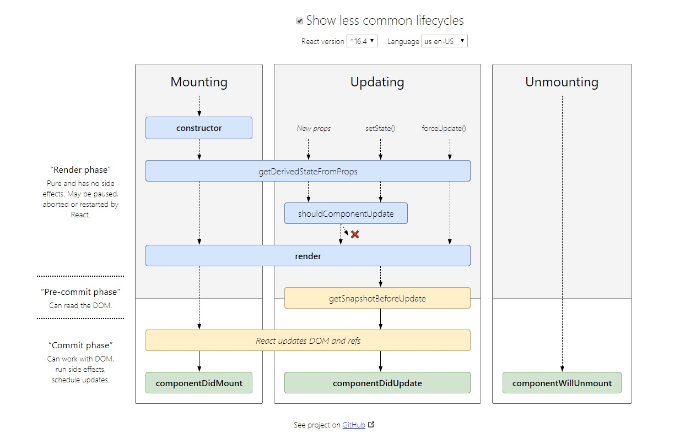

# react life hooks

- before ver-16


- now ver-16



## 1. Mounting(挂载)

### 1.1 constructor()

```$xslt
加载的时候调用一次，可以用来初始化state
```

### 1.2 getDerivedStateFromProps(props, state)

```$xslt
组件每次rerender的时候，包括组件构建之后（虚拟DOM之后，真实DOM之前），每次获取新的props和state之后触发
```

### 1.3 render()

```$xslt
react最重要的步骤，创建虚拟DOM，进行diff算法，更新DOM树。
```

### 1.4 componentDidMount()

```$xslt
组件渲染之后调用，只调用一次
```

## 2. Updating（更新）

### 2.1 getDerivedStateFromProps(props, state)

```$xslt
同上
```

### 2.2 shouldComponentUpdate(nextProps, nextState)

```$xslt
组件接收到新的props或者state时调用，return true（使用diff算法）就会更新DOM，return false不更新DOM。
```

### 2.3 render()

```$xslt
同上。
```

### 2.4 getSnapshotBeforeUpdate(prevProps, prevState)

```$xslt
// 触发时间
Updating时，render之后，组件DOM渲染之前。
// 原理
返回一个值作为componentDidUpdate()的第三个参数
```

### 2.5 componentDidUpdate()

```$xslt
组件加载时不调用，组件更新完成后调用。
```

## 3.Unmounting(卸载)

### 3.1 componentWillUnmount()

```$xslt
组件渲染之后调用，只调用一次
```

## 4. Error Handling

### 4.1 componentDidCatch(err, info)

```$xslt
任何已出的JavaScript错误会触发。
```

## 4. 示例

```js
import React, { Component } from 'react'

export default class NewReactComponent extends Component {
    constructor(props) {
        super(props)
        // getDefaultProps：接收初始props
        // getInitialState：初始化state
    }
    state = {

    }
    static getDerivedStateFromProps(props, state) { // 组件每次被rerender的时候，包括在组件构建之后(虚拟dom之后，实际dom挂载之前)，每次获取新的props或state之后；;每次接收新的props之后都会返回一个对象作为新的state，返回null则说明不需要更新state
        return state
    }
    componentDidCatch(error, info) { // 获取到javascript错误

    }
    render() {
        return (
            <h2>New React.Component</h2>
        )
    }
    componentDidMount() { // 挂载后
        
    }   
    shouldComponentUpdate(nextProps, nextState) { // 组件Props或者state改变时触发，true：更新，false：不更新
        return true
    }
    getSnapshotBeforeUpdate(prevProps, prevState) { // 组件更新前触发

    }
    componentDidUpdate() { // 组件更新后触发

    }
    componentWillUnmount() { // 组件卸载时触发

    }
}
```