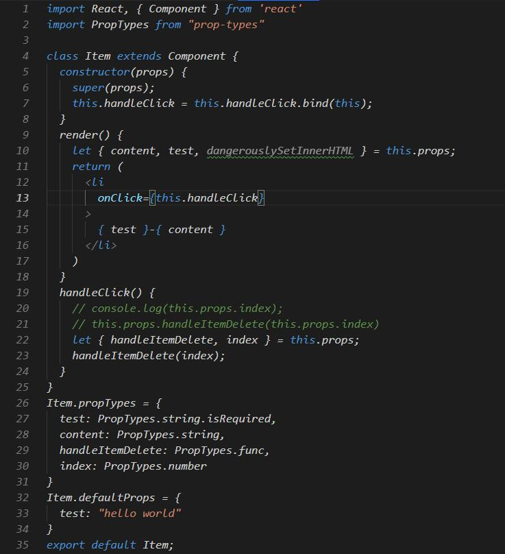

# props&state&render

<!--  -->

```js
import React, { Component } from 'react'
import PropTypes from "prop-types"

class Item extends Component {
  constructor(props) {
    super(props);
    this.handleClick = this.handleClick.bind(this);
  }
  render() {
    let { content, test } = this.props;
    return (
      <li
        onClick={this.handleClick}
      >
        { test }-{ content }
      </li>
    )
  }
  handleClick() {
    let { handleItemDelete, index } = this.props;
    handleItemDelete(index);
  }
}
Item.propTypes = {
  test: PropTypes.string.isRequired,
  content: PropTypes.string,
  handleItemDelete: PropTypes.func,
  index: PropTypes.number
}
Item.defaultProps = {
  test: "hello world"
}
export default Item;
```

> 当组件的state或者props发生改变的时候，render函数就回重新执行。