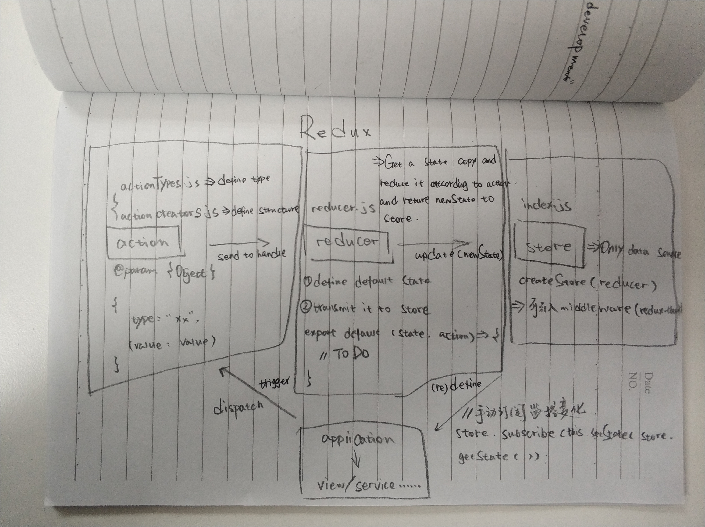

# 1. redux



- redux主要用于状态管理，和vuex是相同的作用。

- 核心为：action；reducer；store

## 1.1 action

- action就是动作，主要是起一个定义的作用。它是一个必须带key为type的对象（value可以自己定义），其他的key可选。

- @param type 必选 =》 用于在reducer中做判断然后数据处理

- @structure {Object}

```js
{
  type: "xxx",
  ?key1: "xxx",
  ?key2: "xxxx"
}
```

### 1.1.1 actionTypes.js

- 用于对type的映射。

```js
export const ADD_ITEM = "ADD_ITEM";
export const DELETE_ITEM = "DELETE_ITEM";
```

### 1.1.2 actionCreator.js

- 用于对action数据结构的拼接。

```js
import { ADD_ITEM } from "./actionTypes.js"

export const getAddItemAction = (value) => ({
  type: ADD_ITEM,
  value
});
```

## 1.2 reducer

- reducer其实就是一个工厂函数，接收state和action作为参数，然后返回一个新的state给store。

- @ param state action

- @ return newState

```js
import { ADD_ITEM } from "./actionTypes.js"

const defaultState = {
  inputValue: "",
  list: []
};

export default (state = defaultState, action) => {
  if (action.type === ADD_ITEM) {
    const newState = JSON.parse(JSON.stringify(state));
    newState.push(action.value);
    return newState;
  }
  return state;
}
```

## 1.3 store

- index.js =》 store的入口文件

- createStore 创建store

- createStore(reducer, enhancer);

- 接收到的是reducer返回的newState或者默认的state。

```js
import { createStore } from "redux";
import reducer from "./reducer.js";

let store = createStore(reducer);
export default store;
```

## 1.4 application

### 1.4.1 code 

```js
import { getAddItemAction } from "./actionCreators.js";
import store from "./store";

const action = getAddItemAction(value);
store.dispatch(action);
```

### 1.4.2 monitor

```js
store.subscribe(this.setState(store.getState()));
```
