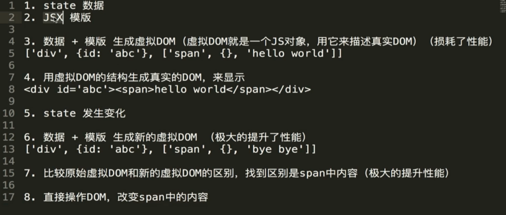

# virtualDom




## 1. JSX

- JSX其实就是语法糖，实现原理就是React.createElement(ele, attribute, content)。

### 1.1 virtualDom

- 虚拟DOM其实就是虚拟的节点。通过js的Object对象模拟DOM中真实的节点对象，再通过特定的render方法将其渲染成真实的DOM节点。

### 1.2 render step

- 1.virtualNode => 2.realNode => 3.render & mount => 4.diff compare

### 1.3 实现

```javascript
// realNode
<span class="hello">hello world</span>

// virtualNode
React.createElement("span", {class: "hello"}, "hello world");

// realNode
<div class="real-div"><span>hello world</span></div>

// virtualNode
React.createElement("div", {class: "real-div"}, React.createElement("span", {}, "hello world"))
```

## 2. diff


### 2.1 传统diff

- 流程图如下


- 传统的diff算法就是对每个结点逐个对比，遍历所有的子节点，判断子节点的更新状态，分别问add/remove/change。

### 2.2 react diff


- react并不会每个节点都对比，而是对比同一层的节点。

- 所以react中的setState是一个异步操作，如果连续有多个setState操作，react会合并成一次。

- react的同级比较：如果这一层没有改变，就暂时不做处理；如果在某一层出现了不同，就会把某一层下的全部节点都替换了。

### 2.3 key


- 节点比较时，我们通过key来比较。所以key的值我们希望在diff时保持不变，也就有了我们不建议循环时的key值用index，因为如果进行了remove等操作后，以前value对应的key会改变，在做diff算法时很消耗性能。